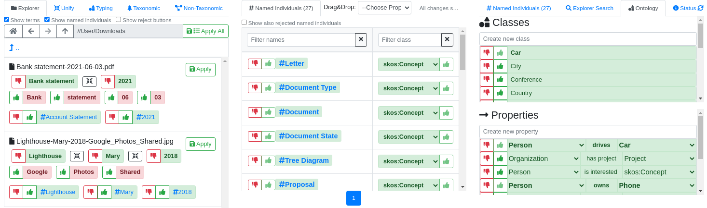

## A Human-in-the-Loop Approach for Personal Knowledge Graph Construction from File Names


The working title of the project was "<b>K</b>nowledge <b>E</b>xtraction from <b>C</b>lassification <b>S</b>chemes" (KECS) which is why
this acronym is still used in several places.


This tutorial is written for technical users who would like to use the prototype on their own.
The help page of the tool gives you an overview of all command-line parameters.
```
$ java -jar kecs.jar --help
```

The classification schema can be imported from different sources.
In all cases a folder is created that stores your feedback progress.
Since bootstrapping could overwrite already established progress, you have to specify an output folder that
does not exist yet.

### Try out the Demo

Before using the tool on real data, you can try out a demo filesystem to learn how to use the application.
```
$ java -jar kecs.jar --mode Demo
```
The server runs on <a target="_blank" href="http://localhost:7572">http://localhost:7572</a> (default user <code>test</code> and password <code>test</code>).


### Define an Ontology (Optional)

Before bootstrapping, you can define a simple ontology in JSON format, for example
[ontology.json](data/ontology.json).
This way, classes and properties are preloaded when using the tool.
The default place where the ontology is loaded is <code>ontology.json</code>,
but you can change it with the <code>--ontology</code> argument.
```
$ java -jar kecs.jar --ontology another-ontology.json
```
If no ontology file is found, a default ontology is loaded.
This behavior can be disabled with the <code>--no-default-ontology</code> switch.

### Bootstrap a native filesystem (recommended)

The input has to be a folder.
Use <code>--limit</code> to specify how many files should be crawled in the breadth-first traversal.
The default is 100,000 which is the size the prototype should handle well.
```
$ java -jar kecs.jar --mode BootstrapFilesystem --input /home/user/folder --limit 100000 --output kecs
```

### Bootstrap a filesystem dump

To create a filesystem filename dump use the linux <code>find</code> command.
```
$ find "$(pwd -P)" -printf "%y %p\n" | gzip > dump.txt.gz
```


If the filename ends with <code>gz</code>, GZIP unzip is automatically applied.
Use <code>--file-separator</code> to specify the separator in the path.
```
$ java -jar kecs.jar --mode BootstrapFilesystemDump --input dump.txt.gz --file-separator / --output kecs
```
Specify the character encoding (e.g. <code>--charset Windows-1252</code>) when it differs from the default UTF-8.
Use the option <code>--file-path-list</code> if you have a list of file paths instead of the <code>find</code> output.


### Bootstrap an Excel file

For a special use case the tool is also able to import an Excel file.
We assume that the first row in a sheet contains column names.
The following tree structure is extracted:
<ul>
    <li>
        sheet name
        <ul>
            <li>
                column name
                <ul>
                    <li>
                        distinct textual cell values
                    </li>
                </ul>
            </li>
        </ul>
    </li>
</ul>

```
$ java -jar kecs.jar --mode BootstrapExcel --input excel.xlsx --output kecs
```


You can whitelist columns (by letters) that should include distinct textual cell values.
Do this to filter columns with too much data.
```
--excel-whitelist 'sheetname1:A,B,C;sheetname2:Z,AB'
```


### Run Server



To access the graphical user interface you have to load the created folder and start a localhost server.
```
$ java -jar kecs.jar --mode Load --output kecs --server
```
The server runs on
<a target="_blank" href="http://localhost:7572">http://localhost:7572</a> (default user <code>test</code> and password <code>test</code>).
Port can be changed with <code>--port</code> argument.
The <code>--browser</code> option opens the website with your default browser.
The <code>--language</code> option sets the language (choose from 'semweb', 'en' or 'de'. Default is 'semweb').

#### Configure User Access


To configure who has access to the user interface, a file <code>users.csv</code> has to
be completed (file can be changed with <code>--users</code> argument).
If there is no such file, a default file is created with the following content:
```
username,password,first name,last name
test,test,Test,Test
```
For tests you can login with the default user <code>test</code> and password <code>test</code>.


In case you run this service for external project partners, change the user list as needed and restart the program.
Distribute credentials to the corresponding people to give them access.
